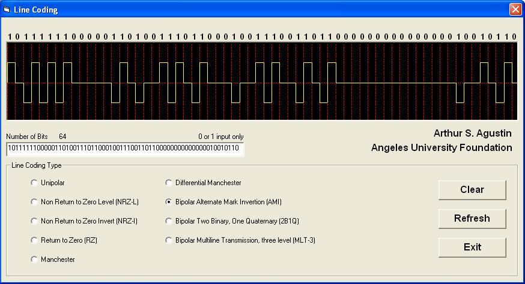



## Line Coding Digital

### Description

helps students in coverting binary digits to line coding display
 
### More Info
 
binary digits

line coding

             |
---                |---
**Submitted On**   |2006-04-29 14:50:36
**By**             |[Arthur Agustin](https://github.com/Planet-Source-Code/PSCIndex/blob/master/ByAuthor/arthur-agustin.md)
**Level**          |Advanced
**User Rating**    |5.0 (10 globes from 2 users)
**Compatibility**  |VB 6\.0
**Category**       |[Coding Standards](https://github.com/Planet-Source-Code/PSCIndex/blob/master/ByCategory/coding-standards__1-43.md)
**World**          |[Visual Basic](https://github.com/Planet-Source-Code/PSCIndex/blob/master/ByWorld/visual-basic.md)
**Archive File**   |[Line\_Codin199130522006\.zip](https://github.com/Planet-Source-Code/arthur-agustin-line-coding-digital__1-65108/archive/master.zip)

